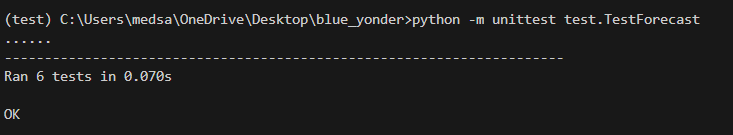
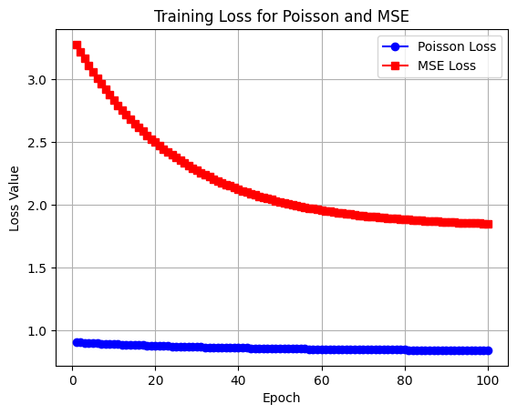
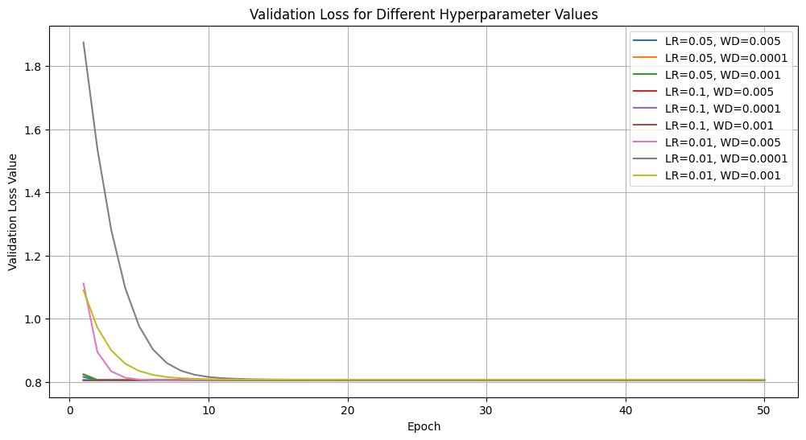
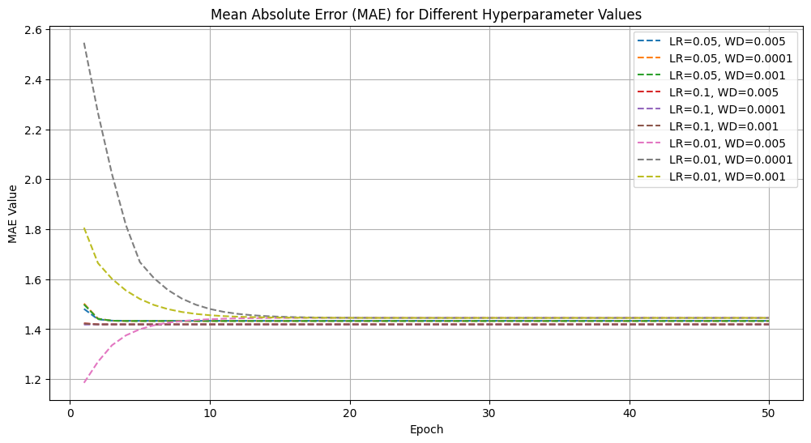
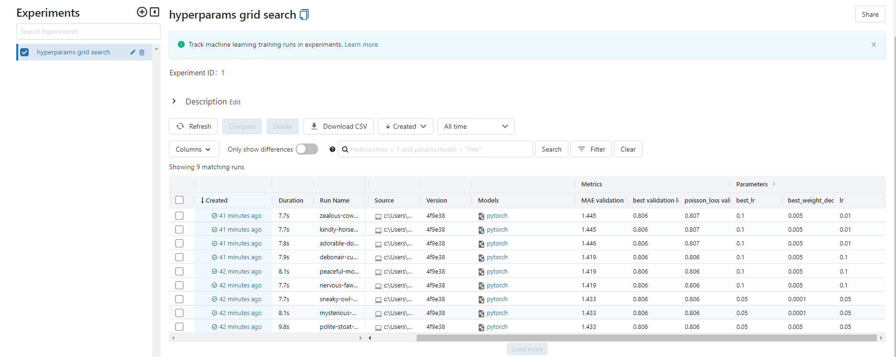

# Blue Yonder Assessment test

 the project involves forecasting the daily demand of an online retailer over a certain time period based on historical sales data. The dummy dataset includes information on stocks (inventory) available for sale each day, providing an upper limit for possible sales.

## The project tasks include:

### Loss Function Development:

- Designing a loss function in PyTorch tailored for the forecasting problem.
Considering the Poisson distribution for demand.
Model Training and Optimization:

- Implementing a dummy model (MeanModel) and training it using gradient descent.
Utilizing different hyperparameters such as learning rates and weight decays.

### Hyperparameter Tuning:

- Performing hyperparameter tuning through grid search with different learning rates and weight decays.
Evaluating and comparing model performance using validation loss and mean absolute error (MAE).
Experiment Tracking with MLflow:

- Logging hyperparameters, metrics, and the trained model using MLflow.
Visualizing and comparing results with plots for loss and MAE.

### Project Version Control:

- Utilizing Git and possibly DVC (DAGsHub) for version control and experiment tracking.

### Unit Testing:

- Implementing unit tests for specific components, such as the MeanModel and the loss function.

### Documentation:
- Testing the loading of models from MLflow and tracking experiments.
- documented functions

## Table of Contents

- [Installation](#installation)
- [Folder Structure](#folder-structure)
- [Dependencies](#dependencies)
- [Running tests](#running-the-code)
- [Results](#results)

## Installation

how to install any dependencies and how to set up the project.

```
python setup.py

```
## folder structure

#### loss_functions.py: loss functions used for training the model </br>
- poisson loss <br>
- mse loss <br>
- poisson loss with penality (not used)<br>
- mae metric <br>

#### model.py: MeanModel class

#### setup.py: file to install the dependencies from requirements.txt

#### test.py: unit tests of the loss functions, model training, and evaluation

#### mlruns: the ml experiments, you can access them through: mlflow ui 
make sure you have python/Scripts in your environment variables.

# Dependencies:
-pytorch<br>
-mlflow<br>
-numpy<br>
-matplotlib<br>

# Running the code
you  can run the experiments in the jupyter notebook called train.ipynb<br>
for the unit tests, they can be run using the command:

```
python -m unittest test.TestForecast
```



# results




